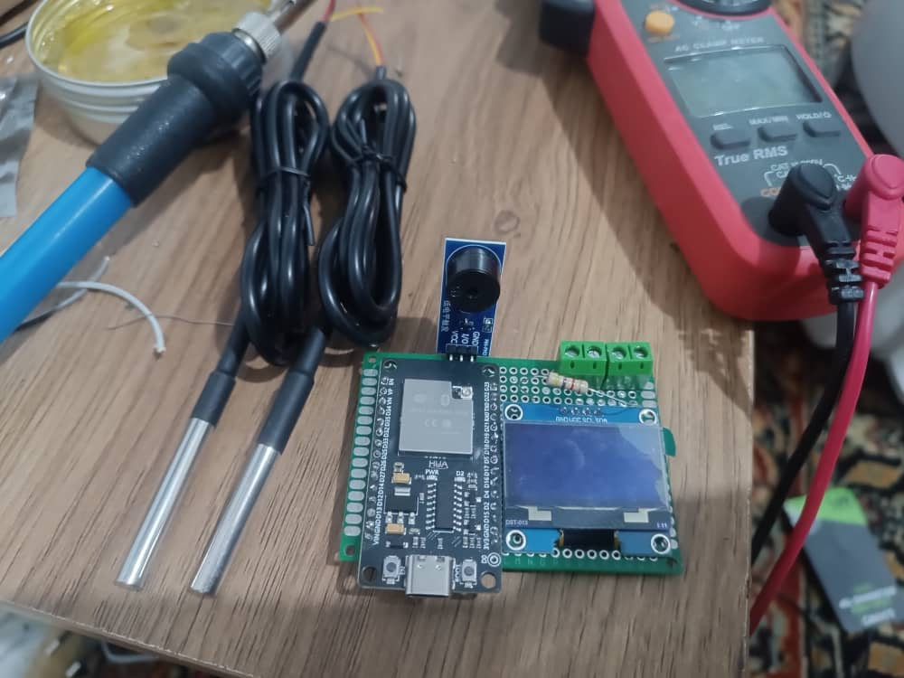

# GPUs Temperature Monitoring System

This project is a temperature monitoring system designed to track temperatures using an ESP32 microcontroller and display the data on a PC dashboard. It is suitable for monitoring GPU rigs or other equipment.

<p align="center">

</p>

## Project Structure

- **dashboard/**: Contains the Python-based PC application for visualization and control.
- **firmware/**: Contains the Arduino code for the ESP32 microcontroller.

## Hardware Requirements

- ESP32 Development Board
- DS18B20 Temperature Sensors
- SH1106 OLED Display (128x64)
- Piezo Buzzer
- 4.7k Ohm Resistor (pull-up for DS18B20)
- Connecting wires and breadboard/PCB
  
<p align="center">


## Software Requirements

### Dashboard
- Python 3.8 or higher
- PyQt6
- pyqtgraph
- websockets
- pandas
- openpyxl

### Firmware
- Arduino IDE
- ESP32 Board support installed in Arduino IDE
- Libraries:
    - ESPAsyncWebServer
    - AsyncTCP
    - OneWire
    - DallasTemperature
    - U8g2
    - ArduinoJson

## Installation and Usage

### 1. Firmware (ESP32)

1. Open `firmware/esp32_firmware/esp32_firmware.ino` in Arduino IDE.
2. Update the WiFi credentials (SSID and Password) in the code.
3. Install the required libraries via the Arduino Library Manager.
4. Select your ESP32 board and COM port.
5. Upload the code to the ESP32.
6. The OLED display will show the assigned IP address once connected to WiFi.

### 2. Dashboard (PC)

    

1. Navigate to the `dashboard` directory.
2. Create a virtual environment (optional but recommended):
   ```bash
   python -m venv venv
   source venv/bin/activate  # On Windows: venv\Scripts\activate
   ```
3. Install dependencies:
   ```bash
   pip install -r requirements.txt
   ```
4. Run the application:
   ```bash
   python main.py
   ```
5. Enter the IP address displayed on the ESP32 OLED screen into the dashboard and click Connect.

## Usage Guide

- **Connect**: Enter the ESP32 IP address and click the plug icon to connect.
- **Sensors**: Use the spinner to select the number of sensors to display (1, 2, or 3).
- **Alarm**: The system will trigger an alarm if the temperature exceeds the defined threshold.
- **Logs**: Temperature data is automatically saved to CSV files in the dashboard directory.

## License

This project is open source.
